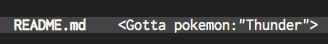
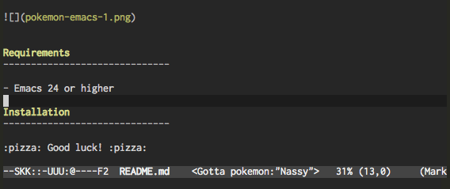

Pokémon-Emacs
==================================================

Pokemon might be in your open file....




Requirements
------------------------------

- Emacs 24 or higher
- The variable `mode-line-buffer-identification` is included in `mode-line-format`

    ```
    (when (memq 'mode-line-buffer-identification mode-line-format)
      t) ; => t
    ```

Installation
------------------------------

:pizza: Good luck! :pizza:

Usage
------------------------------

```
M-x pokemon-emacs-mode
```



Pokémon is determined uniquely by your open filename (or buffer-name).

License
------------------------------

MIT
